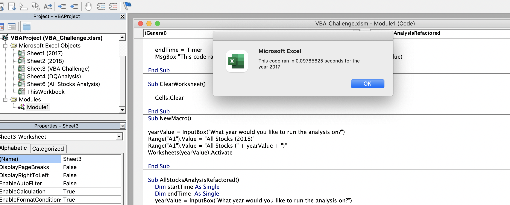
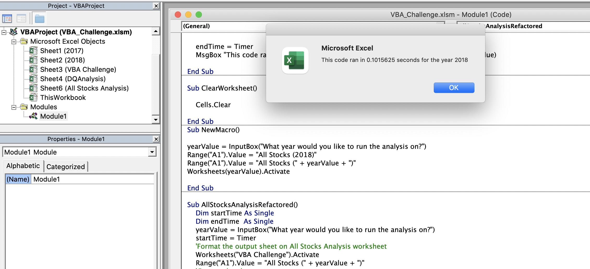

# VBA Challenge (stock-analysis)
## PURPOSE

The purpose of this challenge is to analyze the stocks over the last few years using VBA in excel. We helped Steve who wants to be able to click one buttom and get the years return of various stocks. We were able to do this by writing in codes in the VBA using macros. 

We started off with the given data of 2017 and 2018 stock performance. However, we ended up refactoring the code so that it can calculate all of the stocks data regardless of year. The first step of the code asks the individual for the year of the stock performance calculation. And by doing so it can narrow down the data sets it has to use for the table it will create. 

## RESULTS

Below are the daily total volume and return for the stocks in 2017 and 2018

We see that in 2017 the stocks did much better than in 2018. In 2017, only one stock "TERP" had a negative return (which means it lost money), while every other stock more or less had a positive return. However in 2018, only two stocks "ENPH" and "RUN" had positive returns. I think that because we only calculated the returns over two years, it is not easy to find any trends when looking at stock performance. Which is why the refactor code in VBA should be helpful when Steve acquires data from more years. 

Below are the run times for the calculations of the 2017 stocks and 2018 stocks for the refactored code:

WHen running the refactored code, the execution time for each of the years were more quicker than the execution time for the original script (which came out to be 0.6xxx secs for each 2017 and 2018). This change is because we created an array (TickerIndex) for three separate arrays (TickerVolume, TickerStartingPrices, and TickerEndingPrices). Then we created our if-statements to select the ticker that we are looking for each specific cell and get our total volume and return. As a result, the process was expedited because of the combination of things. 

## SUMMARY

###### What are the advantages or disadvantages of refactoring code?

Advantage of refactoring the code is that the run time will decrease and so it will take the person less time to figure out values for their overall calculations. They will become more fficient and the code will probably be better when there are more values/data to run through. 

Disadvantage is that it might be confusing to refactor codes when there are more arrays and a small mistake in one step can mess up the whole system.

###### How do these pros and cons apply to refactoring the original VBA script?

Same as before, calculating returns and total revenue for the stocks will become quicker and more efficient for Steve. But it might take him a while to go through every year and type out the year to the question and also if there is a small coding mistake the whole system would not work. 
